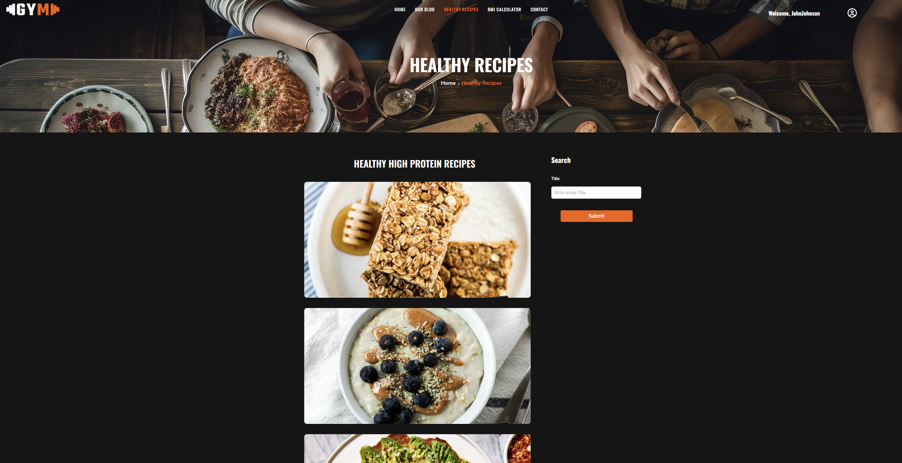
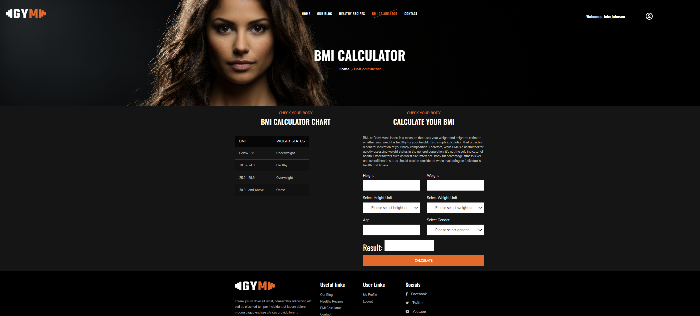
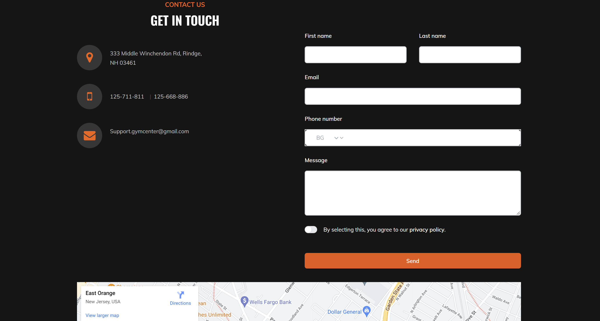
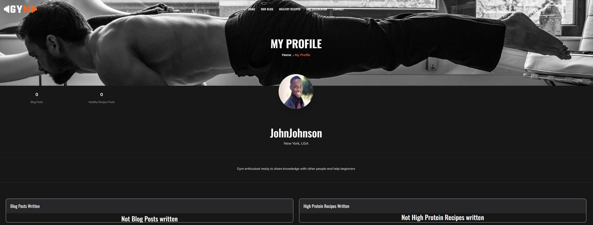

💪 **Fitness Blog Website**
===========================

## 📋 Content
- [Overview](#-overview)
- [Installation](#-installation)
- [Technologies Used](#-technologies-used)
- [Usage](#-usage)
- [Blog Posts](#-blog-posts)
- [High-Protein Recipes](#-high-protein-recipes)
- [BMI Calculator](#-bmi-calculator)
- [Contact Page](#-contact-page)
- [User Profile](#-user-profile)
- [User Authentication](#-user-authentication)
- [Community Engagement](#-community-engagement)
- [License](#-license)

📖 **Overview**
---------------
Welcome to the Fitness Blog Website, a comprehensive platform tailored for fitness enthusiasts to share their journeys, knowledge, and recipes. This dynamic site, built using React.js, offers a user-friendly experience, allowing users to engage with content, share their own stories, and discover healthy recipes to support their fitness goals.
<!--  -->

🚀 **Installation**
-------------------
- First, download the project from [here](https://github.com/GrigorM-debug/Fitness-Blog-ReactJS/archive/refs/heads/main.zip).
- Extract it in seperated folder
- I recommmed using Visual Studio Code, so that you can open the folder with VS Code and run the project and server by writting the commands below, but you use Command Prompt, Windows PowerShell or something like that
- Now lets write some commands
    1. Running the server
        - First write __cd server__ to go to the server folder
        - Second write __node server.js__ to run the server
        - After running the server leave the terminal and don't touch it
        - To stop the server just press __Ctrl + C__ and the server will stop
    2. Running the project
        - Open new terminal
        - Write __cd client__ to go to the client folder
        - Write __npm install__ ot the short version __npm i__ to install all dependencies
        - To start the project write __npm run dev__
        - If you want to stop the project press __Ctrl + C__ in the terminal 
        - You will see this message - __^C^Terminate batch job (Y/N)?__
            press Y or y and then press enter and the project will stop

🛠️ **Technologies Used**
--------------------------
- **React.js:** The core library for building the user interface.
- **Tailwind CSS:** A utility-first CSS framework used for styling and designing the website.
- **Template:** Parts of the design are based on templates from <a href="https://colorlib.com/wp/templates/">Colorlib</a>, which provide a modern and visually appealing look.
- **Responsive Design**
- **EmailJS** - JS library for sending emails

💡 **Usage**
------------
- **Reading Posts:** Visit the blog section to read posts. No login required.
- **Creating Posts/Recipes:** Sign in to create and manage your own blog posts and recipes.
- **Interacting with Content:** Like and comment on posts and recipes, regardless of login status. Users can also reply and like other users comments.
- **Profile Management:** Access and edit your profile details from the "My Profile" page.

📝 **Blog Posts**
-----------------
The blog section is the heart of the Fitness Blog Website. It allows users to:

- **Read Blog Posts:** Browse through a wide range of posts written by fitness enthusiasts, covering topics from workout routines and fitness tips to personal fitness journeys and success stories.
- **Categories:** Blog posts are organized into several categories for easier navigation:
    - **Training:** Everything dedicated to training, including bodybuilding, powerlifting, calisthenics, and more.
    - **Competitions:** Everything about the competitive side of fitness. This includes bodybuilding competitions, powerlifting competitions, predictions for upcoming events like the next powerlifting world championship or the next Mr. Olympia.
    - **Nutrition:** Posts focused on diet and nutrition, sharing tips, meal plans, and dietary advice.
    - **Health & Recovery:** Tips and information on how to stay healthy, recover from workouts, and maintain overall wellness.
- **Like and Comment:** Engage with posts by liking and commenting. This feature is available to registered users. Users can reply and like other users comments.
- **Create Posts:** Registered users can share their own fitness experiences and knowledge by writing and publishing blog posts.
- **Edit and Delete:** Users have complete control over their content and can edit or delete their own posts as needed.

🍲 **High-Protein Recipes**
---------------------------
A special section dedicated to sharing healthy high-protein recipes, perfect for those looking to enhance their diet with nutritious options:

- **Discover Recipes:** Browse through a curated list of high-protein recipes that are loved by the fitness community. Contrary to popular belief, gym-goers and bodybuilders don't just eat boring food; this section showcases a variety of delicious and exciting recipes.
- **Like and Comment:** Engage with recipes by liking and commenting. Only avaiable for registered users. Users can also like and reply to other users comments.
- **Publish Recipes:** Registered users can contribute by sharing their own favorite high-protein recipes.
- **Edit and Delete:** Recipe creators can edit or delete their own recipes, ensuring their content stays up-to-date and accurate.

📊 **BMI Calculator**
---------------------
An essential tool for anyone interested in tracking their fitness progress:

- **Calculate BMI:** Both users and guests can easily calculate their Body Mass Index (BMI) using this tool, helping them understand their body composition and set fitness goals.

✉️ **Contact Page**
-------------------
Stay connected with the site administrators:

- **Reach Out:** Users can use the contact page to send messages or inquiries, providing a direct line of communication with the team behind the Fitness Blog Website.
- After completing the form, an email is sent to our official email address, which is mine 😅.

👤 **User Profile**
-------------------
Each registered user gets a personalized profile page that showcases their activity and contributions:

- **Activity Summary:** View detailed posts made.
- **Interactive Sections:** See lists created posts, providing a comprehensive view of the user’s engagement with the site.

🔒 **User Authentication**
--------------------------
Secure and easy-to-use authentication features:

- **Sign Up and Sign In:** Simple and secure registration and login processes for users to access additional features.
- **User Privacy:** Ensuring user data is protected and privacy is maintained throughout the site.

🌐 **Community Engagement**
--------------------------
The Fitness Blog Website is designed to foster a vibrant community of fitness enthusiasts:

- **Share and Discover:** Encouraging users to share their experiences and discover new ideas and tips from others.
Support and Motivate: Building a supportive environment where users can motivate each other and achieve their fitness goals together.

📜 **License** 
--------------
This project is licensed under the MIT License - see the LICENSE file for details.